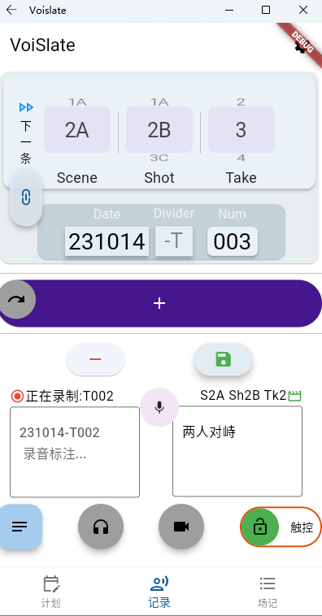
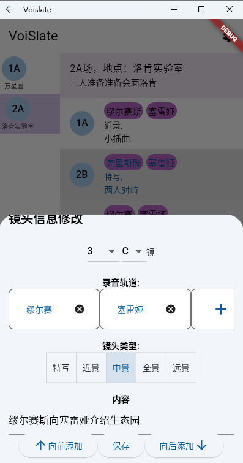
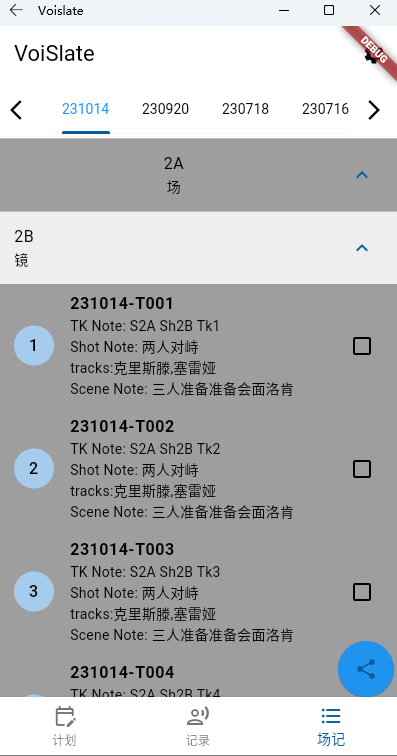
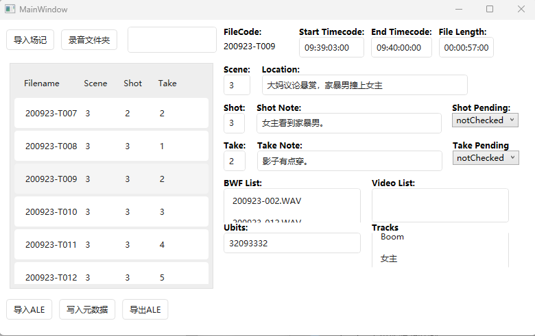

# VoiSlate

用于解决**声音场记**无纸化而设计的App

基于Flutter的，具有语音识别功能的**声音场记**App

配套元数据读写工具VoiSlaui（手机端）、VoiSlateParser（电脑端）

## 主要功能

* 录音记录：

  * 拍摄过程中可以通过简单的操作切换下一条录音对应的场、镜、次；
  * 结合语音识别，做好每一条录音的声音场记；
  * 场记内容分为不变的“镜头内容”和对应每一条的“录音内容”，尽量减少录音过程中操作的频率；
  * 可以评价当前录音，方便声音后期和导演快速找到“过”或“保”的条目；
  * 单独的补录模式，在拍摄后补录条目会单独做标记。

  

* 拍摄计划：拍摄前可以设置好接下来要拍摄的场、镜，以及其他相关信息

* 场记查改：按日期，分场、镜查看/修改所有场记，并且可以将场记以json文件的格式输出，以供 VoiSlaui/VoiSlateParser 使用。

  

* 元数据写入：

  * VoiSlateParser是基于WPF编写的声音场记转声音元数据软件。可以快速查看/修改场记信息，向录音文件写入元数据，将场记写入ALE文件等功能。

  

  * VoiSlaui是基于MAUI编写的声音场记转声音元数据的App，可以满足现场快速向录音文件写入场记数据的需求

## 使用说明

* VoiSlate推荐使用音量键来进行某些操作
* VoiSlaui需自行配备带OTA功能的读卡器。写入完成，确认无误后需手动将新录音复制到SD卡中。

## 开发须知

VoiSlate使用了讯飞的语音识别API，在src/lib/data中有`ifly_key_example.dart`文件作为语音识别API信息的样例。自行创建文件，填入信息，并在`recorder_joystick.dart`中引用。
